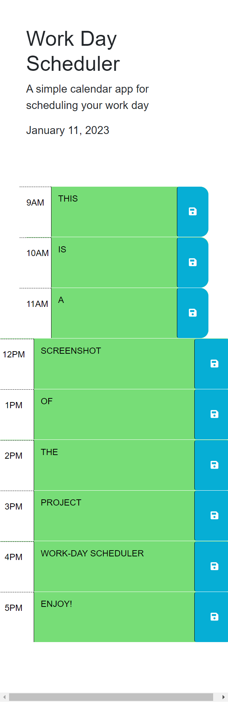

# Work-Day Schedule

# Description

A simple calendar application that allows a user to save events for each hour of the day. This app will run in the browser and feature dynamically updated HTML and CSS powered by jQuery.

# Screenshot

# Usage

Just type activities you need to do on your 9-to-5 schedule, and the next time you reload the page, it will appear!.
